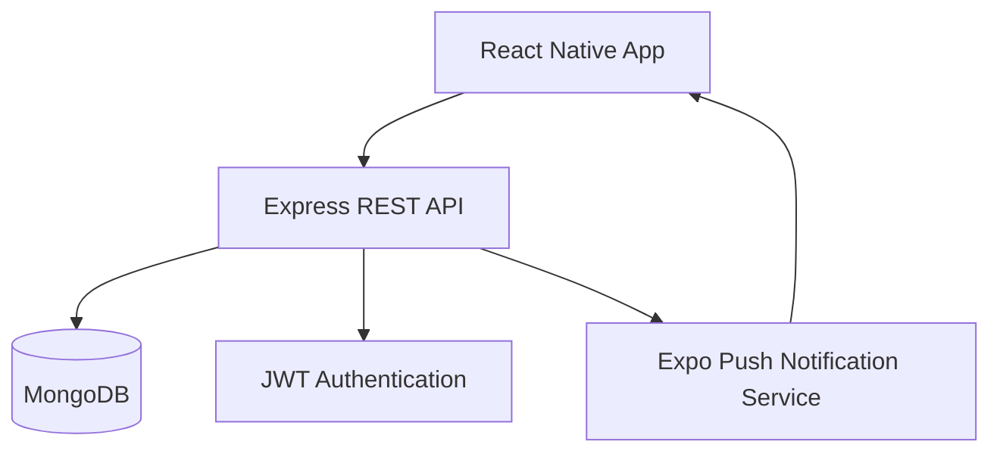

<div align="center">

# 🏢 Nestlist

### Modern Housing Society Management Platform

A premium mobile-first housing society management application built with **React Native**, **Node.js**, and **MongoDB** that simplifies communication between management committees and residents.

<p align="center">
  
  
  
  
  
</p>

### 📱 Download

👉 **[Download Latest APK](https://github.com/aarav12e/Flat_Manager_APK/releases/latest)**

---

</div>

# ✨ Overview

Nestlist is a modern housing society management platform that connects residents and management committees through one seamless mobile application.

It helps societies manage:

- 📢 Notices
- 🔧 Maintenance Requests
- 🏠 Property Listings
- 💬 Suggestions
- 🔔 Push Notifications
- 👥 Resident Directory

---

# 📸 Screenshots

> Add screenshots here

| Login | Home | Notice | Issues |
|-------|------|--------|--------|
| image | image | image | image |

---

# 🚀 Features

## 👨‍💼 Admin

- Society Directory
- Resident Search
- Publish Notices
- Push Notifications
- Manage Maintenance Requests
- Resolve Issues
- View Suggestions
- Send Bill Reminders

---

## 🏠 Residents

- Live Notice Board
- Report Maintenance Issues
- Track Complaint Status
- Property Marketplace
- Rent / Sell Listing
- Suggestion Box
- Push Notifications

---

# 🛠 Tech Stack

| Layer | Technology |
|---------|------------|
| Mobile | React Native (Expo) |
| Backend | Node.js |
| API | Express.js |
| Database | MongoDB Atlas |
| Authentication | JWT |
| Notifications | Expo Push Notifications |
| State Management | React Hooks |
| Storage | AsyncStorage |

---

# 🏗 Architecture



---

# 📂 Repository Structure

```
Flat_Manager_APK
│
├── Backend
│   ├── controllers
│   ├── models
│   ├── routes
│   ├── middleware
│   ├── config
│   └── server.js
│
├── Mobile
│   ├── src
│   ├── assets
│   ├── components
│   └── screens
│
└── README.md
```

---

# ⚙️ Installation

## Clone Repository

```bash
git clone https://github.com/aarav12e/Flat_Manager_APK.git

cd Flat_Manager_APK
```

---

## Backend

```bash
cd Backend

npm install

cp .env.example .env

npm run seed

npm run dev
```

---

## Mobile

```bash
cd Mobile

npm install

npx expo start
```

---

# 🔑 Demo Accounts

## Admin

```
Phone

9999900000

Password

admin123
```

---

## Resident

```
Phone

9876500002

Password

pass123
```

---

# 🌟 Future Improvements

- Online Maintenance Payments
- Visitor Management
- Security Guard Module
- Event Management
- Parking Management
- QR-based Visitor Entry
- Complaint Analytics
- Dark Mode
- Multi-language Support
- Admin Dashboard (Web)

---

# 📦 Releases

Download the latest Android APK from:

👉 https://github.com/aarav12e/Flat_Manager_APK/releases/latest

---

# 🤝 Contributing

Contributions are welcome.

1. Fork the repository
2. Create your feature branch
3. Commit your changes
4. Push to the branch
5. Open a Pull Request

---

# 📄 License

This project is licensed under the MIT License.

---

# 👨‍💻 Author

**Aarav Kumar**

GitHub

https://github.com/aarav12e

---

⭐ If you like this project, consider giving it a Star!
