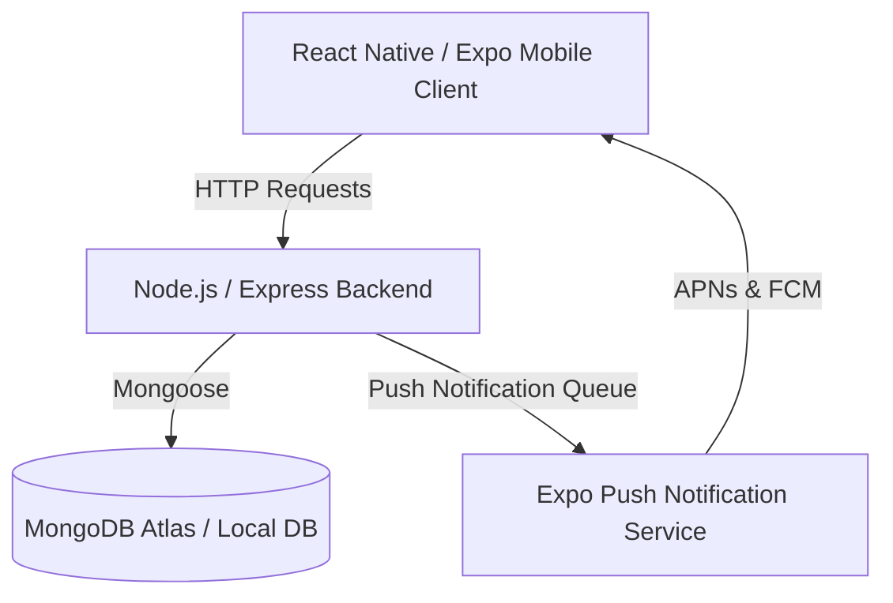

# Nestlist (FlatManager)

Nestlist is a modern, premium mobile-first housing society management application designed to connect building administrators and apartment owners. It streamlines announcements, maintenance issue reporting, unit listing on the market, and suggestion collections in one clean dashboard.

---

## 🚀 Features

### For Admins (Management Committee)
*   **Society Directory**: Access a complete roster of flat owners, search by flat numbers, and send manual maintenance bill reminders.
*   **Notice Broadcasts**: Instantly publish announcements to the notice boards of all flats with push notifications.
*   **Issues Management**: Track, review, and mark reported plumbing, electrical, or structural issues as resolved.
*   **Suggestion Box**: Collect and review anonymous or attributed improvement ideas from residents.

### For Owners (Residents)
*   **Live Notice Board**: Stay updated with society announcements and targeted push notifications.
*   **Property Status**: List your flat "For Rent" or "For Sale" with custom details, visible immediately in the directory.
*   **Issue Reporting**: Raise maintenance requests directly to the admin.
*   **Suggestions**: Submit feedback or ideas for building improvements.

---

## 🛠️ Architecture & Tech Stack



*   **Frontend Mobile App**: Built using **React Native (Expo SDK 51)**. It incorporates a sleek, premium design language featuring custom gradient buttons (`expo-linear-gradient`), interactive status pills, animated skeleton shimmer states, and safe-area notch layout wrappers (`react-native-safe-area-context`).
*   **Backend REST API**: Node.js & Express server featuring JWT authentication, request validation, and background push notification dispatching via the **Expo Server SDK**.
*   **Database**: MongoDB hosted on Atlas (or run locally) configured through Mongoose schemas.

---

## 📁 Repository Structure

```
├── Backend/                 # Express API server, models, controllers & DB seed script
├── Mobile/                  # React Native client app (Expo project)
├── .gitignore               # Root level Git exclusions
└── README.md                # This project overview & documentation
```

---

## ⚙️ Getting Started

### 1. Prerequisites
*   Install **Node.js (v18+)** on your machine.
*   Install the **Expo Go** app on your physical iOS or Android device to test the mobile app.

---

### 2. Backend Setup
1. Open a terminal and navigate to the backend folder:
   ```bash
   cd Backend
   ```
2. Install the server dependencies:
   ```bash
   npm install
   ```
3. Copy the example environment file to `.env`:
   ```bash
   cp .env.example .env
   ```
4. Open the `.env` file and configure:
   *   `MONGO_URI`: Your MongoDB database connection string.
   *   `PORT`: Set to `5001` (avoid `5000` on macOS due to AirPlay conflicts).
5. Seed the database with sample admin, owner accounts, and mock notice cards:
   ```bash
   npm run seed
   ```
6. Start the development server with live reload:
   ```bash
   npm run dev
   ```

---

### 3. Mobile Setup
1. Open a new terminal and navigate to the mobile folder:
   ```bash
   cd Mobile
   ```
2. Install the mobile dependencies:
   ```bash
   npm install
   ```
3. Open `src/services/api.js` and change the `BASE_URL` IP address to match your machine's local network IP address (e.g., `http://192.168.x.x:5001/api`), so the emulator or physical device can reach the server.
4. Launch the Expo Metro bundler:
   ```bash
   npx expo start
   ```
5. Scan the QR code displayed in the terminal with the Expo Go app on your phone.

---

## 🔑 Demo Login Credentials (Seeded)

Once you seed the database, you can log in using these preset credentials in the login page:

*   **Society Admin Account**:
    *   **Phone**: `9999900000`
    *   **Password**: `admin123`
      
*   **Flat Owner Account (A-102)**:
    *   **Phone**: `9876500002`
    *   **Password**: `pass123`

---

## ⚠️ Troubleshooting Database Timeout / Whitelist Warnings
If the backend crashes on startup with a MongoDB connection timeout or DNS resolution error:
1. **Network Port Blocks (Operation Timed Out)**: Some public, office, or university Wi-Fi networks block outbound traffic on port `27017` (default MongoDB port). Switch your computer to a **mobile hotspot** or enable a **VPN** to bypass the network-level blocking.
2. **MongoDB Atlas Whitelist**: Ensure you have added `0.0.0.0/0` (Access from anywhere) in the **Network Access** panel on your MongoDB Atlas dashboard to allow dynamic IP connections during testing.
